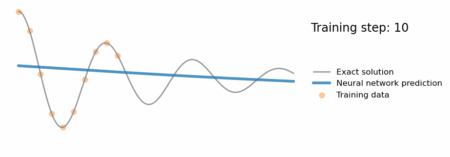
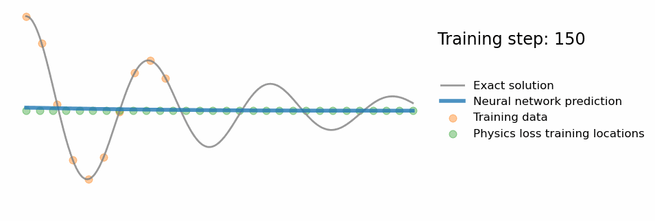

# harmonic-oscillator-pinn
An approach to solving the harmonic oscillator equations using a modified physics-based loss function in a neural network to improve from a purely "data-driven" approach.

## Traditional Approach

## Physics-Informed Approach

